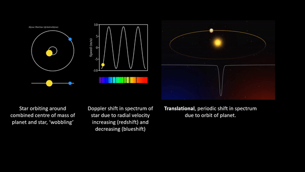
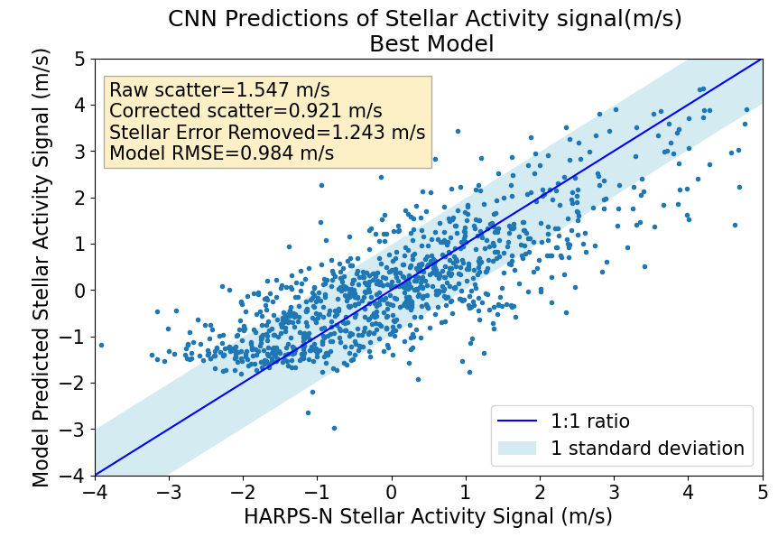

---
authors:
- admin
categories:
date: "2023-09-01T00:00:00Z"
draft: false
featured: false
image:
  caption: ''
  focal_point: ""
  placement: 1
  preview_only: false
lastmod: "2023-12-14T00:00:00Z"
projects: []
subtitle: ""
summary: ""
tags:
title: Mitigating radial velocity jitter from solar activity using Neural Networks
---
## **What is the radial velocity method?**

Out of the 5482 exoplanets that have been discovered so far, we only have the mass for 28% of them. Most of these planets are very large, with masses over 300 times that of Earth, closer to the mass of Jupiter. We want to study exoplanets similar to Earth and look for biosignatures (signs of extra-terrestrial life!). However, we have only discovered 83 planets that have a mass less than 3 times that of Earth.

We can find the mass of an exoplanet using the radial velocity method. When a planet orbits a star, they both induce a gravitational pull on one another, causing the star to also have a small orbit around their combined centre of mass. The larger the mass of the planet, the large the gravitational pull, causing a larger wobble of the star.
We can detect this movement by looking at the absorption spectrum of the star. This is the radial velocity method for detecting exoplanets, we look for translational, periodic changes in the spectrum.

To measure this radial velocity shift, we can use cross-correlation functions (CCFs).  First solar spectra data is collected using a spectrograph. Then, a binary mask, shown here in orange, is created, representing absorption lines from the sun as delta functions. Then, a CCF is produced, shown on the right, by sliding the binary mask over the solar spectrum and calculating the correlation at each position. The shape of this function tells us how the absorption lines shift over time in the spectra. Peaks in the CCF indicate positions where absorption lines in the binary mask align well with features appearing in the solar spectrum, so they correspond to where the translational shifts are.

## **Why is it hard to detect low mass exoplanets?**

For a planet with a lower mass, similar to Earth, the effect of the change in the shape of the CCF will be smaller. But radial velocity measurements are heavily affected by noise coming from stellar activity from the stars.

If we look at our own sun, there is lots of activity on the surface. For example, there are areas of high magnetic activity, reducing convection in the area, which makes sunspots appear. These cause redshifts, and changes the shape of the CCF. The problem is that sunspots on sun-like stars cause a 5 m/s radial velocity jitter, whereas earth-like planets only give a 10 cm/s radial velocity signal, meaning that the noise from the sunspots hide the translational exoplanet signals.

Neural networks are one of the best ways to do pattern recognition, so we have been making a neural network to help detect the subtle CCF shape changes. Neural networks also do not require high-cadence observations unlike other methods such as Gaussian process regression.

## **What is in my neural network?**

There are many measurements we have of the Sun which can indicate the activity on its surface and therefore the radial velocity shifts caused. I have been improving on the neural network developed in de Beurs et al. (2022) which takes the CCFs as an input, and outputs the predicted radial velocity. I experiment with inputting the following additional features:
-	Total solar irradiance
-	Total solar irradiance time derivative
-	Unsigned magnetic flux
-	Chromatic CCFs  (blue, yellow, red)
-	S-Index
-	Equivalent widths of H-alpha, Sodium D lines
FWHM, contrast, and bisector span of CCFs

## **What are the best features?**

We evaluate how well the neural networks predict the radial velocity jitter of the Sun using the root mean squared error between the labels (true radial velocity) and predicted radial velocity (from the neural network). We found that the best model used the CCFs, the total solar irradiance, and the unsigned magnetic flux.

## **Final results**

Our final neural network model reduced the radial velocity scatter on around 1000 observations from the HARPS-N Solar Telescope from 154.7 cm/s to 92.1 cm/s, around a 40% improvement. These results have been submitted as a journal article to MNRAS.

These results can be used to know which stellar activity features would be most appropriate to use when applying similar techniques to stars outside of our solar system, to remove the stellar activity noise, and detect exoplanets similar to Earth. The remaining noise is likely due to instrumental precision, and granulation and supergranulation (Lakeland et al. 2023) which cannot be detected from commonly used stellar activity indicators. In the future it will be important to be able to characterise the noise from granulation and supergranulation so that we can reduce the radial velocity precision even further and detect Earth like exoplanets around Sun-like stars. 
